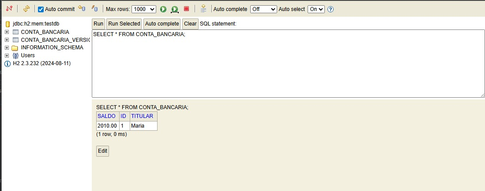

# Projeto de Concorrência com Spring Boot

## Integrante
Ludmila Johnston

## Objetivo do Projeto
O objetivo desse projeto é estudar concorrência em uma aplicação backend feita com Spring Boot, verificando como o sistema se comporta com várias requisições ao mesmo tempo e se os dados continuam consistentes.

## Descrição
Esse projeto foi desenvolvido com Spring Boot e banco de dados H2 simulando um sistema bancário simples. Ele permite criar contas, fazer depósitos e saques por meio de endpoints REST. Também foram feitos testes de concorrência usando o Apache JMeter para analisar o comportamento da aplicação com múltiplas requisições simultâneas.

## Tecnologias Utilizadas
Java 17
Spring Boot
Spring Data JPA
Banco de Dados H2
Apache Maven
Apache JMeter
Thunder Client

## Arquitetura do Projeto
O projeto segue o padrão MVC (Model-View-Controller), onde o Controller gerencia os endpoints, o Service contém as regras de negócio e o Repository é responsável pelo acesso ao banco de dados.

## Como Executar o Projeto
Pré-requisitos: Java 17 ou superior e Maven instalado. 
Para rodar o projeto, execute no terminal dentro da pasta o comando .\mvnw.cmd spring-boot:run.\mvnw.cmd spring-boot:run
A aplicação será iniciada na porta 8080.

## Banco de Dados H2
O projeto utiliza banco de dados em memória H2. O acesso é feito pelo console em http://localhost:8080/h2-console
JDBC URL jdbc:h2:mem:testdb
Usuário: sa
Senha: em branco

## Endpoints Utilizados
POST /contas?titular=Maria&saldo=1000 (criar conta)  
POST /contas/{id}/deposito?valor=10 (depósito)  
POST /contas/{id}/saque?valor=10 (saque)  
## Testes Realizados
Os endpoints foram testados inicialmente no Thunder Client para validação das rotas. Em seguida, foi utilizado o Apache JMeter para simular múltiplas requisições simultâneas no endpoint de depósito, configurado com 10 usuários, ramp-up de 1 segundo e loop de 10, totalizando 100 requisições.

## Resultado do Teste
O saldo inicial da conta era R$ 1.010,00. Após 100 depósitos de R$ 10,00, o saldo final foi R$ 2.010,00, demonstrando o comportamento da aplicação sob concorrência.

## Comparação das Abordagens

### Conta sem controle de concorrência
A conta bancária sem controle de versão está sujeita a problemas de concorrência, como atualização perdida (Lost Update), quando múltiplas requisições tentam alterar o mesmo saldo simultaneamente.

### Conta com controle de versão (@Version)
A conta versionada utiliza a anotação @Version do JPA para implementar controle otimista de concorrência. Quando duas transações tentam atualizar o mesmo registro ao mesmo tempo, o Hibernate detecta o conflito e impede a sobrescrita indevida dos dados.

### Conclusão
A utilização do controle de versão aumenta a consistência dos dados e reduz problemas causados por acessos concorrentes.

## Evidências
Spring Boot rodando: 

API funcionando: 

Banco H2: 

Configuração do JMeter: 

Resultado do JMeter: 

View Results Tree: 

## Observação Final
### Conclusão

Durante os testes foi possível observar a importância do controle de concorrência em aplicações que realizam várias operações ao mesmo tempo. Na conta sem controle de versão podem ocorrer problemas de atualização dos dados quando diferentes requisições acessam o mesmo registro simultaneamente.

Já na conta versionada, a utilização da anotação @Version ajuda a evitar conflitos de atualização, tornando as operações mais seguras e mantendo a consistência dos dados. Os testes realizados mostraram na prática a diferença entre as duas abordagens.
